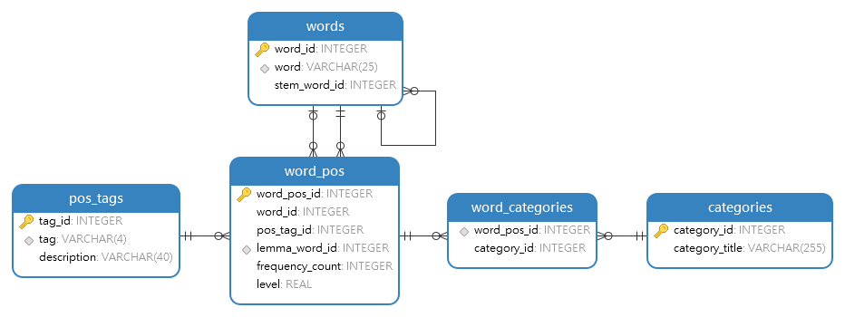

# Words CEFR Dataset

This project focuses on analyzing and categorizing English words based on their CEFR levels (from A1 to C2). I computed CEFR levels for every valid English word and its corresponding part of speech by by considering various factors including the average levels of other parts of speech for the same word, lemma levels, stem levels, as well as lemma, stem, and word frequencies.

## Example of usage

To perform a basic word CEFR analysis, execute the **Text-Analizer.ipynb** file. This notebook provides a practical demonstration of how to analyze words and determine their corresponding CEFR levels.

### Demo text (generated by ChatGPT 3.5):

```
In the heart of every forest, a hidden world thrives among the towering trees. Trees, those silent giants, are more than just passive observers of nature's drama; they are active participants in an intricate dance of life.

Did you know that trees communicate with each other? It's not through words or gestures like ours, but rather through a complex network of fungi that connect their roots underground. This network, often called the "wood wide web," allows trees to share nutrients, water, and even warnings about potential threats.

But trees are not just generous benefactors; they are also masters of adaptation. Take the mighty sequoias, for example, towering giants that have stood the test of time for thousands of years. These giants have evolved thick, fire-resistant bark to withstand the frequent wildfires of their native California.

And speaking of longevity, did you know that some trees have been around for centuries, witnessing history unfold? The ancient bristlecone pines of the American West, for instance, can live for over 5,000 years, making them some of the oldest living organisms on Earth.

So the next time you find yourself wandering through a forest, take a moment to appreciate the remarkable world of trees. They may seem like silent spectators, but their lives are full of fascinating stories waiting to be discovered.
```

### Results:

```
NLP: 318 ms
CEFR levels: 3 ms
------------------------------
Text length: 1370
Total tokens: 275
```

```
CEFR statistic (total words):
A1: 136
A2: 37
B1: 27
B2: 11
C1: 2
C2: 7

CEFR statistic (unique words):
A1: 69
A2: 34
B1: 23
B2: 11
C1: 2
C2: 7
```

```
Not found words: 0
```

```
Words with level B2 and higher: 17
mighty                     JJ     4.00   B2
potential                  JJ     4.00   B2
bristlecone                NN     6.00   C2
living                     NN     4.00   B2
longevity                  NN     5.97   C2
california                 NNP    6.00   C2
benefactors                NNS    6.00   C2
fungi                      NNS    5.19   C1
masters                    NNS    4.00   B2
observers                  NNS    4.00   B2
pines                      NNS    4.00   B2
sequoias                   NNS    6.00   C2
wildfires                  NNS    6.00   C2
underground                RB     4.00   B2
withstand                  VB     5.12   C1
evolved                    VBN    4.00   B2
thrives                    VBZ    5.86   C2
```


## Data Collection Process

### Making English valid words list

For this project I created a [valid English words list](https://github.com/Maximax67/English-Valid-Words). It includes word, frequency count and word stems along with their associated probabilities of being valid words. For this project I used [valid_words_sorted_by_frequency.csv](https://github.com/Maximax67/English-Valid-Words/blob/main/valid_words_sorted_by_frequency.csv) file, so all words in words table in SQLite database are sorted by frequency.

### Data Processing Steps

The data processing pipeline, implemented in the **Word-CEFR.ipynb** notebook, involves the following steps:

1. **Parsing Google 1-grams Dataset**: Extracting frequency data for valid words part of speech with frequency counts more than 10,000. I used [spaCy](https://spacy.io/) for more accurate part-of-speech (POS) tagging based on the [Penn Treebank Project's list of POS tags](https://www.ling.upenn.edu/courses/Fall_2003/ling001/penn_treebank_pos.html). Additionally, I used [LemmInflect](https://github.com/bjascob/LemmInflect) for obtaining word lemmas.

2. **Parsing CEFR-J Dataset**: I parsed it to get CEFR level for some words based on its POS. In this step I also parsed core usage categories.

3. **Calculation of Average Frequencies for each CEFR level and Interpolation**.

4. **Assigning CEFR Levels**: Determining the CEFR level for each word's POS based on average levels of other POS for the same word, lemma levels, stem levels, as well as lemma, stem and word frequencies.

5. **Database Optimization**: Minimizing database size by consolidating word frequency data from 1900 to 2019 into a single total value. Additionally, calculating the average POS level from all available sources. SQLite database is now optimized and has a reduced size of 20MB. Refer to the **Minify_db.ipynb** file for more details.

## Possible Improvements

1. **Incorporating Additional Datasets**: To obtain more precise data, consider parsing the [Octanove Vocabulary profile](https://github.com/openlanguageprofiles/olp-en-cefrj/blob/master/octanove-vocabulary-profile-c1c2-1.0.csv) dataset, which provides C1 and C2 level vocabulary data. However, please note that this dataset is licensed under the [Creative Commons Attribution-ShareAlike 4.0 International License](https://creativecommons.org/licenses/by-sa/4.0/). Also you can parse [World level survey by Zenodo](https://zenodo.org/records/12501) dataset to further enrich the dataset. This dataset, licensed under the [Creative Commons Attribution 4.0 International license](https://creativecommons.org/licenses/by/4.0/legalcode).

2. **Filtering Personal Names and Geographical Entities**: you can improve result accuracy by implementing mechanisms to identify and exclude personal names, countries, cities, and other such entities from displaying CEFR levels. This refinement can help ensure that the analysis focuses solely on linguistic content.

## Dataset files included

1. **word_cefr_minified.db**: SQLite3 database.



2. **csv/words.csv**:
    * word_id
    * word
    * stem_word_id

3. **csv/word_pos.csv**:
    * word_pos_id
    * word_id
    * pos_tag_id
    * lemma_word_id
    * frequency_count
    * level

4. **csv/word_categories**:
    * word_pos_id
    * category_id

5. **csv/pos_tags.csv**:
    * tag_id
    * tag
    * description

6. **csv/categories.csv**:
    * category_id
    * category_title

## License
This project is licensed under the MIT License - see the LICENSE file for details.

## Acknowledgments
I would like to acknowledge the contributions of the following resources:
- [Spacy](https://spacy.io/)
- [CEFR-J](https://cefr-j.org/)
- [LemmInflect](https://github.com/bjascob/LemmInflect)
- [The Google Books Ngram Viewer (used 1-grams dataset, version 20200217)](https://books.google.com/ngrams/)
- [List of pos tags form Penn Treebank Project](https://www.ling.upenn.edu/courses/Fall_2003/ling001/penn_treebank_pos.html)

Also I used these resources to create my [valid English words list](https://github.com/Maximax67/English-Valid-Words):
- [Word list by infochimps (archived)](https://web.archive.org/web/20131118073324/https://www.infochimps.com/datasets/word-list-350000-simple-english-words-excel-readable)
- [English words github repo by dwyl](https://github.com/dwyl/english-words)
- [NLTK (Natural Language Toolkit)](https://www.nltk.org/)
- [WordNet](https://wordnet.princeton.edu/)
